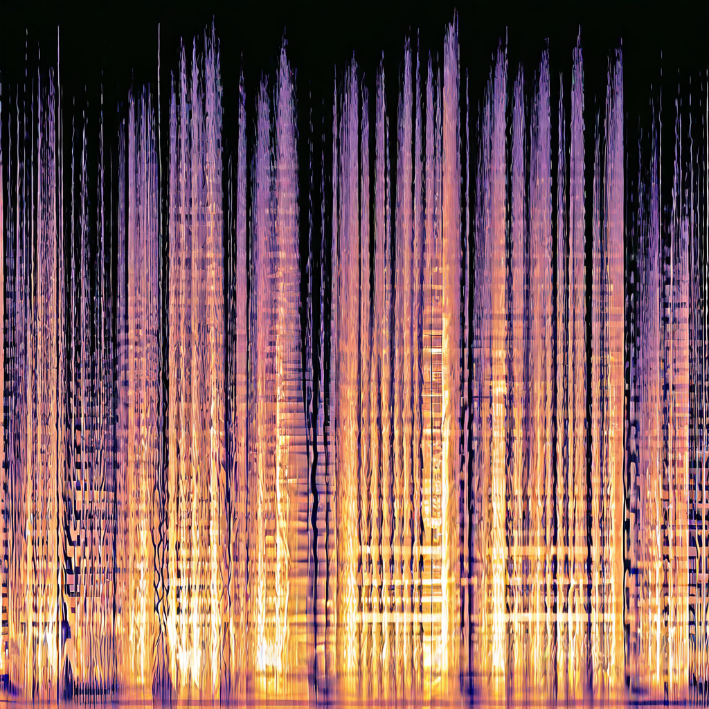
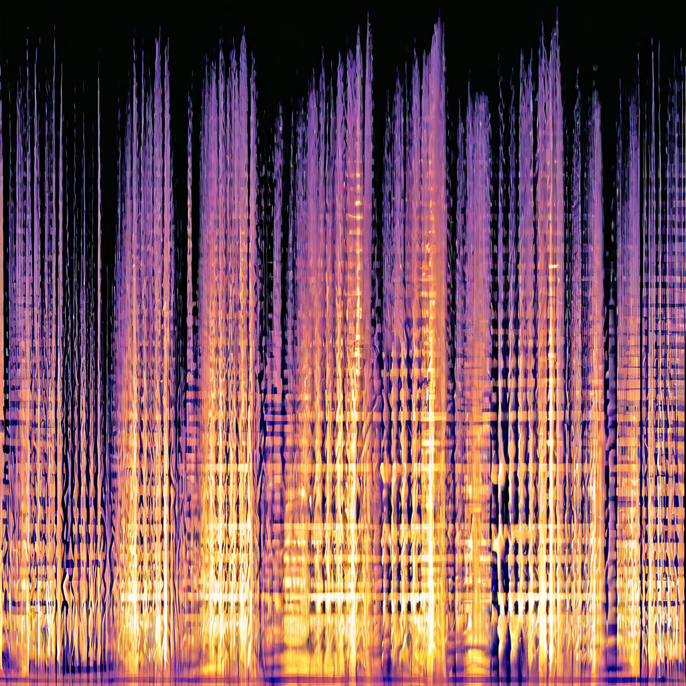
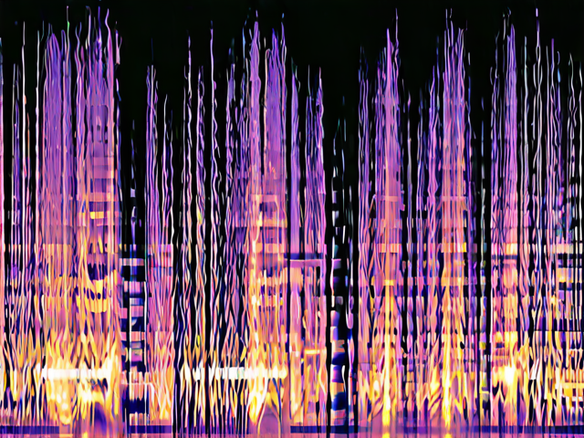
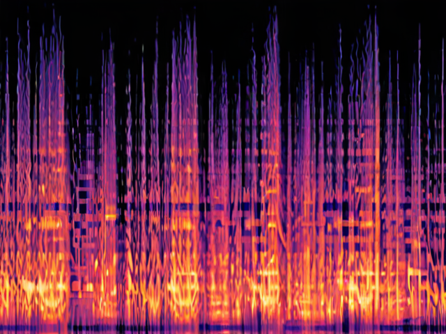
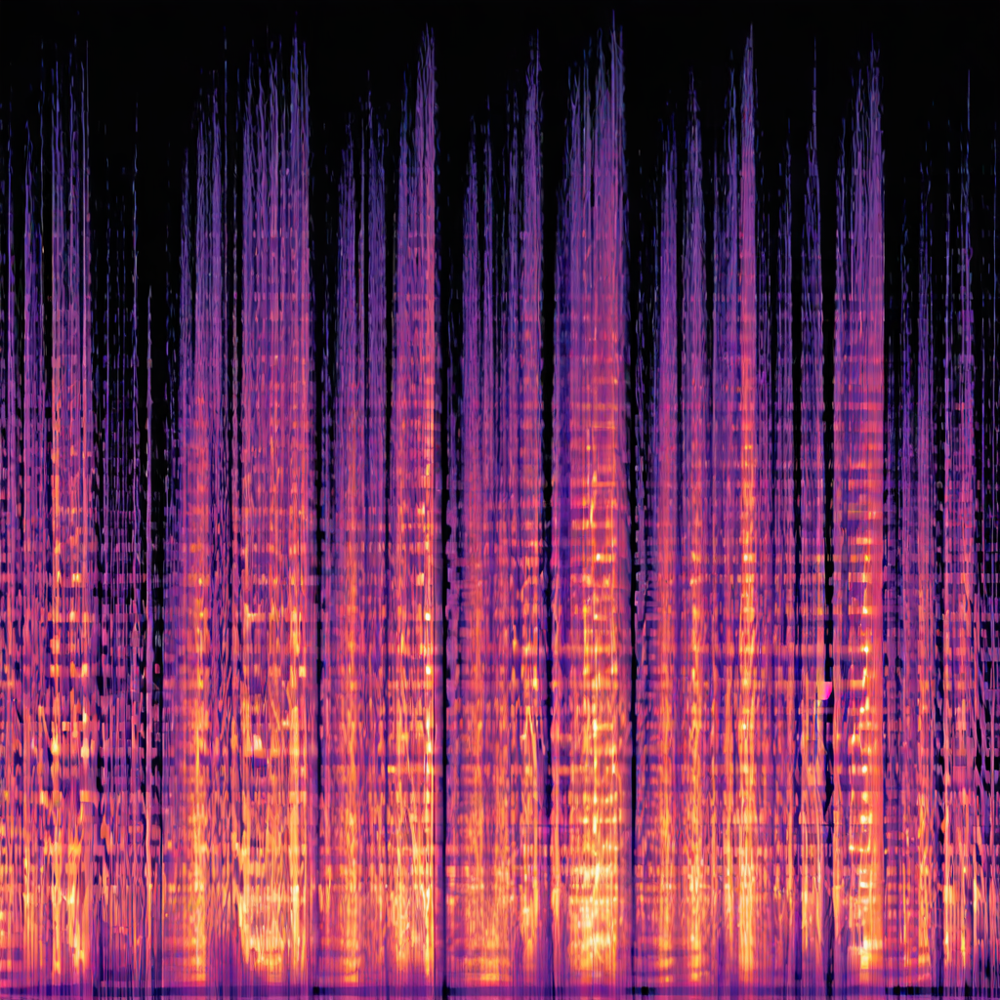
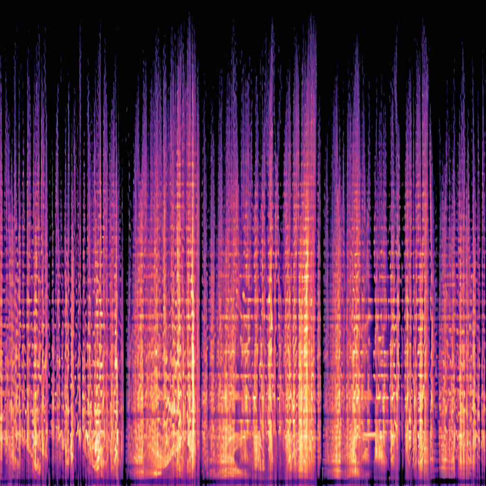

# SDXL-LoRA-beethoven-melspectrogram

SDXL LoRAs can produce great image results. But can they produce coherent music by generating mel spectrograms(basically image versions of songs)? That's what we're experimenting with here.

- Replicate API: https://replicate.com/georgedavila/sdxl-beethoven-spectrograms-lora
- Model: https://huggingface.co/GDavila/sdxl-beethoven-spectrograms

Trigger word: SPECTROGRAM

- [X] Audio to image spectrogram scripts
- [X] Model trained
- [X] Model deployed to replicate
- [ ] Image spectrogram to audio scripts

## Make Spectrograms

Place audio data in directory `audio_data` and run `python makeMels.py` to create spectrograms which will be placed in `mels` directory. 

## Training
Zip `mels` directory and use [sdxl-lora-customize-training](https://replicate.com/zylim0702/sdxl-lora-customize-training) for easy lora training. 

### References 

- Data sourced from https://www.chosic.com/free-music/beethoven/
- https://github.com/OmarMedhat22/Sound-Classification-Mel-Spectrogram/blob/master/mel%20spectrogram.ipynb
- https://importchris.medium.com/how-to-create-understand-mel-spectrograms-ff7634991056
- https://stackoverflow.com/questions/60365904/reconstructing-audio-from-a-melspectrogram-has-some-clipping-with-librosa
- https://librosa.org/doc/main/generated/librosa.feature.inverse.mel_to_audio.html#librosa.feature.inverse.mel_to_audio

## Results

[Examples](https://replicate.com/georgedavila/sdxl-beethoven-spectrograms-lora/examples)

- 1) Prompt: "A SPECTROGRAM image", No Negative Prompt, width=1024, height=1024, guidanceScale=7.5, num_inference_steps=50

- 2) Prompt: "A SPECTROGRAM image", Negative Prompt: "fuzzy, lone pixels", width=1024, height=1024, guidanceScale=7.5, num_inference_steps=50

- 3) Prompt: "A SPECTROGRAM image", No Negative Prompt, width=640, height=480, guidanceScale=7.5, num_inference_steps=50

- 4) Prompt: "A SPECTROGRAM image", Negative Prompt: "noisy", width=640, height=480, guidanceScale=7.5, num_inference_steps=50

- 5) Prompt: "A SPECTROGRAM image", Negative Prompt: "noisy", width=1024, height=1024, guidanceScale=7.5, num_inference_steps=50

- 6) Prompt: "A photo of a dog in the style of SPECTROGRAM", Negative Prompt: "noisy", width=1024, height=1024, guidanceScale=7.5, num_inference_steps=50

- 7) Prompt: "A photo of a dog in the style of SPECTROGRAM", Negative Prompt: "noisy", width=1024, height=1024, guidanceScale=40.0, num_inference_steps=100
