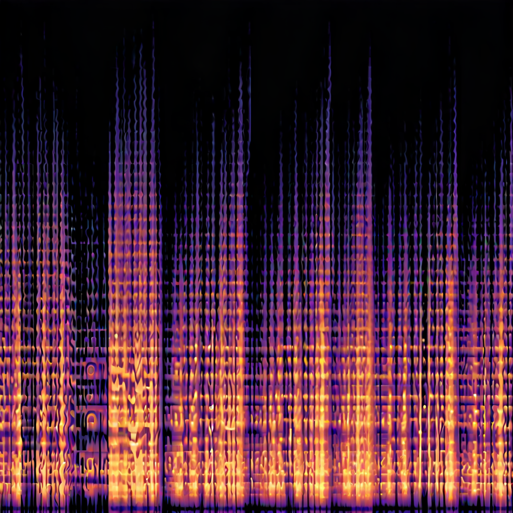

# SDXL-LoRA-beethoven-melspectrogram

SDXL LoRAs can produce great image results. But can they produce coherent music by generating mel spectrograms(basically image versions of songs)? That's what we're experimenting with here.

- Replicate API: https://replicate.com/georgedavila/sdxl-beethoven-spectrograms-lora
- Model: https://huggingface.co/GDavila/sdxl-beethoven-spectrograms

Trigger word: SPECTROGRAM

- [X] Audio to image spectrogram scripts
- [X] Model trained
- [X] Model deployed to replicate
- [ ] Image spectrogram to audio scripts

## Make Spectrograms

Place audio data in directory `audio_data` and run `python makeMels.py` to create spectrograms which will be placed in `mels` directory. 

## Training
Zip `mels` directory and use [sdxl-lora-customize-training](https://replicate.com/zylim0702/sdxl-lora-customize-training) for easy lora training. 

### References 

Putting an audio file in and out of these two source should generate a coherent output albeit with large loss of audio fidelity:
- Generate spectrograms from audio online: https://convert.ing-now.com/audio-spectrogram-creator/
- Convert Spectrogram image to audio online: https://alexadam.github.io/demos/img-encode/index.html (be sure to set the time to the time of the input audio)

- Data sourced from https://www.chosic.com/free-music/beethoven/
- https://github.com/OmarMedhat22/Sound-Classification-Mel-Spectrogram/blob/master/mel%20spectrogram.ipynb
- https://importchris.medium.com/how-to-create-understand-mel-spectrograms-ff7634991056
- https://stackoverflow.com/questions/60365904/reconstructing-audio-from-a-melspectrogram-has-some-clipping-with-librosa
- https://librosa.org/doc/main/generated/librosa.feature.inverse.mel_to_audio.html#librosa.feature.inverse.mel_to_audio

## Results

[Examples](https://replicate.com/georgedavila/sdxl-beethoven-spectrograms-lora/examples)

- 1) Prompt: "A SPECTROGRAM image", No Negative Prompt, width=1024, height=1024, guidanceScale=7.5, num_inference_steps=50

- 2) Prompt: "A SPECTROGRAM image", Negative Prompt: "fuzzy, lone pixels", width=1024, height=1024, guidanceScale=7.5, num_inference_steps=50

- 3) Prompt: "A SPECTROGRAM image", No Negative Prompt, width=640, height=480, guidanceScale=7.5, num_inference_steps=50

- 4) Prompt: "A SPECTROGRAM image", Negative Prompt: "noisy", width=640, height=480, guidanceScale=7.5, num_inference_steps=50

- 5) Prompt: "A SPECTROGRAM image", Negative Prompt: "noisy", width=1024, height=1024, guidanceScale=7.5, num_inference_steps=50

- 6) Prompt: "A photo of a dog in the style of SPECTROGRAM", Negative Prompt: "noisy", width=1024, height=1024, guidanceScale=7.5, num_inference_steps=50

- 7) Prompt: "A photo of a dog in the style of SPECTROGRAM", Negative Prompt: "noisy", width=1024, height=1024, guidanceScale=40.0, num_inference_steps=100

Clearly we can produce coherent spectorgrams using SDXL LoRAs, its not simply noise otherwise we wouldn't see clear waveforms and the black on top orange on bottom type structure. In [example 7](https://github.com/GeorgeDavila/SDXL-LoRA-beethoven-melspectrogram/blob/main/results/res7.png) we can see stratification layers ie striped bands emerge in the waveforms. Notably the swirls are a characteristic sign that stable diffusion can't fully denoise a region, so it's not necessarily fully denoising the wave forms. See [here](https://upload.wikimedia.org/wikipedia/commons/9/99/X-Y_plot_of_algorithmically-generated_AI_art_of_European-style_castle_in_Japan_demonstrating_DDIM_diffusion_steps.png) for an example of SD denoising - those swirls are artifacts of step 1. But overall these are very interesting results considering we only used 7 audio samples and only trained a LoRA. 

